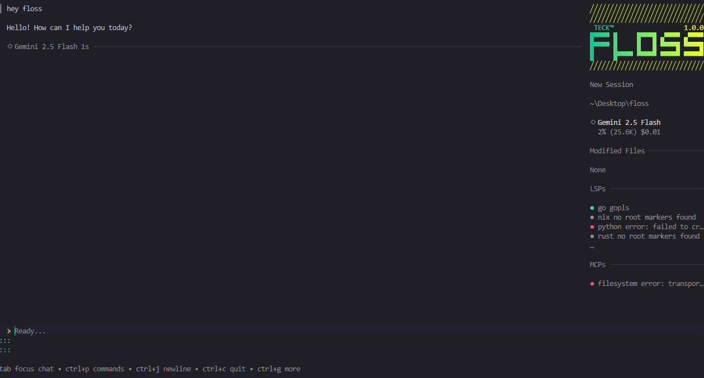

# Floss

<p align="center">
    <a href="https://github.com/nom-nom-hub/floss/releases"></a>
    <a href="https://github.com/nom-nom-hub/floss/actions"></a>
</p>

<p align="center">
    
</p>

<p align="center">Your new coding bestie, now available in your favourite terminal.<br />Your tools, your code, and your workflows, wired into your LLM of choice.</p>

## Features

- **Multi-Model:** Choose from a wide range of LLMs or add your own via OpenAI- or Anthropic-compatible APIs
- **Flexible:** Switch LLMs mid-session while preserving context
- **Session-Based:** Maintain multiple work sessions and contexts per project
- **LSP-Enhanced:** Floss uses LSPs for additional context, just like you do
- **Extensible:** Add capabilities via MCPs (`http`, `stdio`, and `sse`)
- **Works Everywhere:** First-class support in every terminal on macOS, Linux, Windows (PowerShell and WSL), FreeBSD, OpenBSD, and NetBSD

## Installation

Use a package manager:

```bash
# Homebrew
brew install nom-nom-hub/tap/floss

# NPM
npm install -g @nom-nom-hub/floss

# Arch Linux (btw)
yay -S floss-bin

# Nix
nix run github:numtide/nix-ai-tools#floss
```

Windows users:

```bash
# Winget
winget install nom-nom-hub.floss

# Scoop
scoop bucket add floss https://github.com/nom-nom-hub/scoop-bucket.git
scoop install floss
```

<details>
<summary><strong>Debian/Ubuntu</strong></summary>

```bash
sudo mkdir -p /etc/apt/keyrings
curl -fsSL https://repo.nom-nom-hub.sh/apt/gpg.key | sudo gpg --dearmor -o /etc/apt/keyrings/floss.gpg
echo "deb [signed-by=/etc/apt/keyrings/floss.gpg] https://repo.nom-nom-hub.sh/apt/ * *" | sudo tee /etc/apt/sources.list.d/floss.list
sudo apt update && sudo apt install floss
```

</details>

<details>
<summary><strong>Fedora/RHEL</strong></summary>

```bash
echo '[floss]
name=Floss
baseurl=https://repo.nom-nom-hub.sh/yum/
enabled=1
gpgcheck=1
gpgkey=https://repo.nom-nom-hub.sh/yum/gpg.key' | sudo tee /etc/yum.repos.d/floss.repo
sudo yum install floss
```

</details>

Or, download it:

- [Packages][releases] are available in Debian and RPM formats
- [Binaries][releases] are available for Linux, macOS, Windows, FreeBSD, OpenBSD, and NetBSD

[releases]: https://github.com/nom-nom-hub/floss/releases

Or just install it with Go:

```bash
go install github.com/nom-nom-hub/floss@latest
```

## Getting Started

The quickest way to get started is to grab an API key for your preferred
provider such as Anthropic, OpenAI, Groq, or OpenRouter and just start
Floss. You'll be prompted to enter your API key.

That said, you can also set environment variables for preferred providers.

| Environment Variable        | Provider                                           |
| --------------------------- | -------------------------------------------------- |
| `ANTHROPIC_API_KEY`         | Anthropic                                          |
| `OPENAI_API_KEY`            | OpenAI                                             |
| `OPENROUTER_API_KEY`        | OpenRouter                                         |
| `CEREBRAS_API_KEY`          | Cerebras                                           |
| `GEMINI_API_KEY`            | Google Gemini                                      |
| `VERTEXAI_PROJECT`          | Google Cloud VertexAI (Gemini)                     |
| `VERTEXAI_LOCATION`         | Google Cloud VertexAI (Gemini)                     |
| `GROQ_API_KEY`              | Groq                                               |
| `AWS_ACCESS_KEY_ID`         | AWS Bedrock (Claude)                               |
| `AWS_SECRET_ACCESS_KEY`     | AWS Bedrock (Claude)                               |
| `AWS_REGION`                | AWS Bedrock (Claude)                               |
| `AZURE_OPENAI_API_ENDPOINT` | Azure OpenAI models                                |
| `AZURE_OPENAI_API_KEY`      | Azure OpenAI models (optional when using Entra ID) |
| `AZURE_OPENAI_API_VERSION`  | Azure OpenAI models                                |

### By the Way

Is there a provider you'd like to see in Floss? Is there an existing model that needs an update?

Floss's default model listing is managed in [Catwalk](https://github.com/charmbracelet/catwalk), a community-supported, open source repository of Floss-compatible models, and you're welcome to contribute.

## Configuration

Floss runs great with no configuration. That said, if you do need or want to
customize Floss, configuration can be added either local to the project itself,
or globally, with the following priority:

1. `.floss.json`
2. `floss.json`
3. `$HOME/.config/floss/floss.json` (Windows: `%USERPROFILE%\AppData\Local\floss\floss.json`)

Configuration itself is stored as a JSON object:

```json
{
  "this-setting": { "this": "that" },
  "that-setting": ["ceci", "cela"]
}
```

As an additional note, Floss also stores ephemeral data, such as application state, in one additional location:

```bash
# Unix
$HOME/.local/share/floss/floss.json

# Windows
%LOCALAPPDATA%\floss\floss.json
```

### LSPs

Floss can use LSPs for additional context to help inform its decisions, just
like you would. LSPs can be added manually like so:

```json
{
  "$schema": "https://nom-nom-hub.land/floss.json",
  "lsp": {
    "go": {
      "command": "gopls",
      "env": {
        "GOTOOLCHAIN": "go1.24.5"
      }
    },
    "typescript": {
      "command": "typescript-language-server",
      "args": ["--stdio"]
    },
    "nix": {
      "command": "nil"
    }
  }
}
```

### MCPs

Floss also supports Model Context Protocol (MCP) servers through three
transport types: `stdio` for command-line servers, `http` for HTTP endpoints,
and `sse` for Server-Sent Events. Environment variable expansion is supported
using `$(echo $VAR)` syntax.

```json
{
  "$schema": "https://nom-nom-hub.land/floss.json",
  "mcp": {
    "filesystem": {
      "type": "stdio",
      "command": "node",
      "args": ["/path/to/mcp-server.js"],
      "env": {
        "NODE_ENV": "production"
      }
    },
    "github": {
      "type": "http",
      "url": "https://example.com/mcp/",
      "headers": {
        "Authorization": "$(echo Bearer $EXAMPLE_MCP_TOKEN)"
      }
    },
    "streaming-service": {
      "type": "sse",
      "url": "https://example.com/mcp/sse",
      "headers": {
        "API-Key": "$(echo $API_KEY)"
      }
    }
  }
}
```

### Ignoring Files

Floss respects `.gitignore` files by default, but you can also create a
`.flossignore` file to specify additional files and directories that Floss
should ignore. This is useful for excluding files that you want in version
control but don't want Floss to consider when providing context.

The `.flossignore` file uses the same syntax as `.gitignore` and can be placed
in the root of your project or in subdirectories.

### Allowing Tools

By default, Floss will ask you for permission before running tool calls. If
you'd like, you can allow tools to be executed without prompting you for
permissions. Use this with care.

```json
{
  "$schema": "https://nom-nom-hub.land/floss.json",
  "permissions": {
    "allowed_tools": [
      "view",
      "ls",
      "grep",
      "edit",
      "mcp_context7_get-library-doc"
    ]
  }
}
```

You can also skip all permission prompts entirely by running Floss with the
`--yolo` flag. Be very, very careful with this feature.

### Attribution Settings

By default, Floss adds attribution information to Git commits and pull requests
it creates. You can customize this behavior with the `attribution` option:

```json
{
  "$schema": "https://nom-nom-hub.land/floss.json",
  "options": {
    "attribution": {
      "co_authored_by": true,
      "generated_with": true
    }
  }
}
```

- `co_authored_by`: When true (default), adds `Co-Authored-By: Floss <floss@nom-nom-hub.land>` to commit messages
- `generated_with`: When true (default), adds `💘 Generated with Floss` line to commit messages and PR descriptions

### Local Models

Local models can also be configured via OpenAI-compatible API. Here are two common examples:

#### Ollama

```json
{
  "providers": {
    "ollama": {
      "name": "Ollama",
      "base_url": "http://localhost:11434/v1/",
      "type": "openai",
      "models": [
        {
          "name": "Qwen 3 30B",
          "id": "qwen3:30b",
          "context_window": 256000,
          "default_max_tokens": 20000
        }
      ]
    }
  }
}
```

#### LM Studio

```json
{
  "providers": {
    "lmstudio": {
      "name": "LM Studio",
      "base_url": "http://localhost:1234/v1/",
      "type": "openai",
      "models": [
        {
          "name": "Qwen 3 30B",
          "id": "qwen/qwen3-30b-a3b-2507",
          "context_window": 256000,
          "default_max_tokens": 20000
        }
      ]
    }
  }
}
```

### Custom Providers

Floss supports custom provider configurations for both OpenAI-compatible and
Anthropic-compatible APIs.

#### OpenAI-Compatible APIs

Here's an example configuration for Deepseek, which uses an OpenAI-compatible
API. Don't forget to set `DEEPSEEK_API_KEY` in your environment.

```json
{
  "$schema": "https://nom-nom-hub.land/floss.json",
  "providers": {
    "deepseek": {
      "type": "openai",
      "base_url": "https://api.deepseek.com/v1",
      "api_key": "$DEEPSEEK_API_KEY",
      "models": [
        {
          "id": "deepseek-chat",
          "name": "Deepseek V3",
          "cost_per_1m_in": 0.27,
          "cost_per_1m_out": 1.1,
          "cost_per_1m_in_cached": 0.07,
          "cost_per_1m_out_cached": 1.1,
          "context_window": 64000,
          "default_max_tokens": 5000
        }
      ]
    }
  }
}
```

#### Anthropic-Compatible APIs

Custom Anthropic-compatible providers follow this format:

```json
{
  "$schema": "https://nom-nom-hub.land/floss.json",
  "providers": {
    "custom-anthropic": {
      "type": "anthropic",
      "base_url": "https://api.anthropic.com/v1",
      "api_key": "$ANTHROPIC_API_KEY",
      "extra_headers": {
        "anthropic-version": "2023-06-01"
      },
      "models": [
        {
          "id": "claude-sonnet-4-20250514",
          "name": "Claude Sonnet 4",
          "cost_per_1m_in": 3,
          "cost_per_1m_out": 15,
          "cost_per_1m_in_cached": 3.75,
          "cost_per_1m_out_cached": 0.3,
          "context_window": 200000,
          "default_max_tokens": 50000,
          "can_reason": true,
          "supports_attachments": true
        }
      ]
    }
  }
}
```

### Amazon Bedrock

Floss currently supports running Anthropic models through Bedrock, with caching disabled.

- A Bedrock provider will appear once you have AWS configured, i.e. `aws configure`
- Floss also expects the `AWS_REGION` or `AWS_DEFAULT_REGION` to be set
- To use a specific AWS profile set `AWS_PROFILE` in your environment, i.e. `AWS_PROFILE=myprofile floss`

### Vertex AI Platform

Vertex AI will appear in the list of available providers when `VERTEXAI_PROJECT` and `VERTEXAI_LOCATION` are set. You will also need to be authenticated:

```bash
gcloud auth application-default login
```

To add specific models to the configuration, configure as such:

```json
{
  "$schema": "https://nom-nom-hub.land/floss.json",
  "providers": {
    "vertexai": {
      "models": [
        {
          "id": "claude-sonnet-4@20250514",
          "name": "VertexAI Sonnet 4",
          "cost_per_1m_in": 3,
          "cost_per_1m_out": 15,
          "cost_per_1m_in_cached": 3.75,
          "cost_per_1m_out_cached": 0.3,
          "context_window": 200000,
          "default_max_tokens": 50000,
          "can_reason": true,
          "supports_attachments": true
        }
      ]
    }
  }
}
```

## Logging

Sometimes you need to look at logs. Luckily, Floss logs all sorts of
stuff. Logs are stored in `./.floss/logs/floss.log` relative to the project.

The CLI also contains some helper commands to make perusing recent logs easier:

```bash
# Print the last 1000 lines
floss logs

# Print the last 500 lines
floss logs --tail 500

# Follow logs in real time
floss logs --follow
```

Want more logging? Run `floss` with the `--debug` flag, or enable it in the
config:

```json
{
  "$schema": "https://nom-nom-hub.land/floss.json",
  "options": {
    "debug": true,
    "debug_lsp": true
  }
}
```

## Disabling Provider Auto-Updates

By default, Floss automatically checks for the latest and greatest list of
providers and models from [Catwalk](https://github.com/charmbracelet/catwalk),
the open source Floss provider database. This means that when new providers and
models are available, or when model metadata changes, Floss automatically
updates your local configuration.

For those with restricted internet access, or those who prefer to work in
air-gapped environments, this might not be want you want, and this feature can
be disabled.

To disable automatic provider updates, set `disable_provider_auto_update` into
your `floss.json` config:

```json
{
  "$schema": "https://nom-nom-hub.land/floss.json",
  "options": {
    "disable_provider_auto_update": true
  }
}
```

Or set the `FLOSS_DISABLE_PROVIDER_AUTO_UPDATE` environment variable:

```bash
export FLOSS_DISABLE_PROVIDER_AUTO_UPDATE=1
```

### Manually updating providers

Manually updating providers is possible with the `floss update-providers`
command:

```bash
# Update providers remotely from Catwalk.
floss update-providers

# Update providers from a custom Catwalk base URL.
floss update-providers https://example.com/

# Update providers from a local file.
floss update-providers /path/to/local-providers.json

# Reset providers to the embedded version, embedded at floss at build time.
floss update-providers embedded

# For more info:
floss update-providers --help
```

## FLOSS Branding

This version of Floss has been customized with a distinctive branding
instead of the original branding. All visual elements, color schemes,
and UI components have been updated to create a unique identity while
maintaining full compatibility with the core Floss functionality.

## Contributing

See the [contributing guide](https://github.com/nom-nom-hub/floss?tab=contributing-ov-file#contributing).

## License

[FSL-1.1-MIT](https://github.com/nom-nom-hub/floss/raw/main/LICENSE.md)